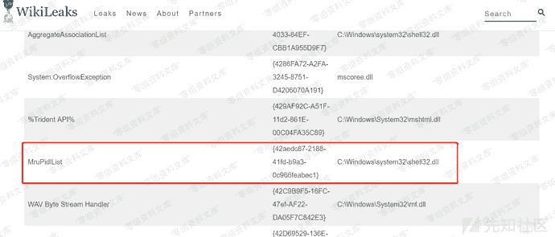
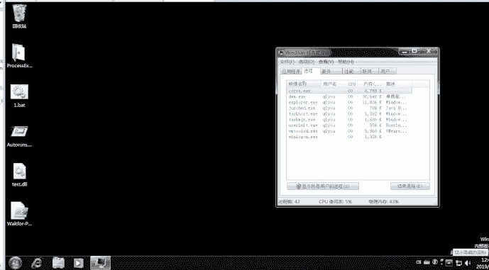

## 劫持MruPidlList

在注册表位置为`HKCU\Software\Classes\CLSID\`下创建项`{42aedc87-2188-41fd-b9a3-0c966feabec1}`，再创建一个子项`InprocServer32`，默认的键值为我们的dll路径，再创建一个键`ThreadingModel`，其键值：`Apartment`

该注册表对应`COM`对象`MruPidlList`，作用于`shell32.dll`，而`shell32.dll`是Windows的32位外壳动态链接库文件，用于打开网页和文件，建立文件时的默认文件名的设置等大量功能。其中`explorer.exe`会调用`shell32.dll`，然后会加载COM对象`MruPidlList`，从而触发我们的`dll`文件

当用户重启时或者重新创建一个`explorer.exe`进程时，就会加载我们的恶意dll文件，从而达到后门持久化的效果。这里我们直接结束一个`explorer.exe`进程再起一个进程来看一下效果

