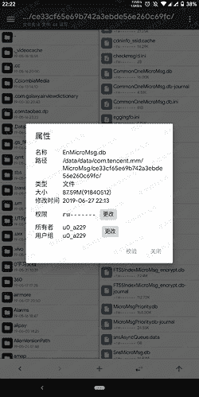
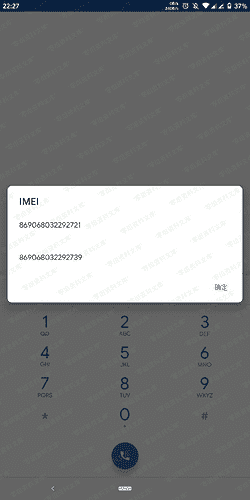
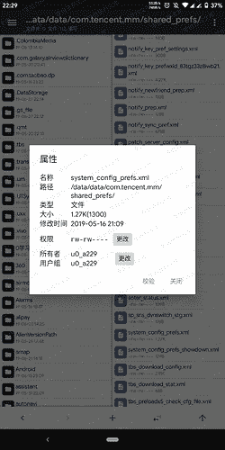
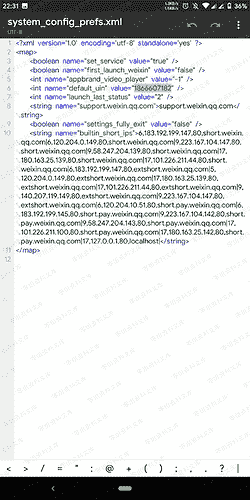
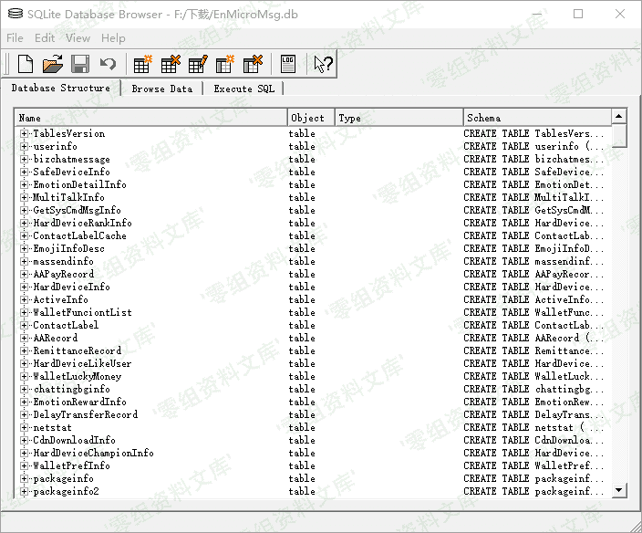
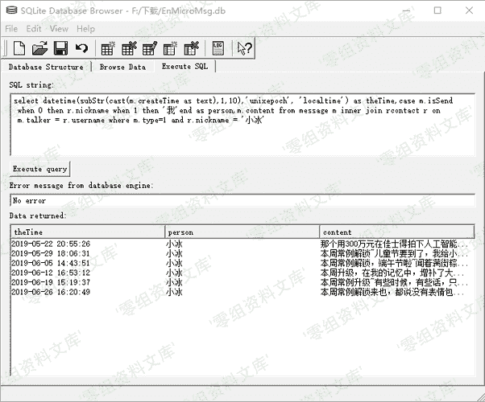
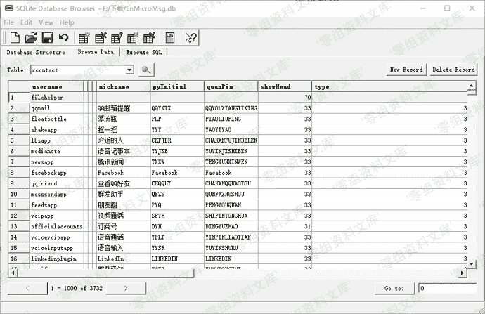

# Android 端微信取证

*   1，获取聊天记录数据库文件



> 数据库文件位于/data/data/com.tencent.mm/MicroMsg/一大串字母数字/EnMicroMsg.db （本文使用的工具为MT管理器2.0）

*   2，获取解密需要的IMEI和UIN

> 多少手机可以在拨号界面输入*#06#获取IMEI，双卡手机会有两个，只需要第一个。



> UIN所在路径为/data/data/com.tencent.mm/shared_prefs/system_config_prefs.xml

> 在文件里找到default_uin，后面的数字就是UIN





> 图中的1866607182就是uin，如果uin为负数，则需要加上4294967296

> 再进行下面的操作

*   3，获取密钥

> 将IMEI和UIN连在一起进行md5加密


> 取加密后的数据的前七位0364371，这就是数据库密钥。

*   4，读取数据

> 因为微信使用的是SQLite数据库，所以使用能读取此数据库的工具进行读取（本文使用的是windows端的sqlcipher）



> 解密出数据库文件

*   5，指定数据查询

```
select datetime(subStr(cast(m.createTime as text),1,10),'unixepoch', 'localtime') as theTime,case m.isSend when 0 then r.nickname when 1 then '我'end as person,m.content from message m inner join rcontact r on m.talker = r.username where m.type=1 and r.nickname = '对方微信昵称' 
```



> 成功获取到聊天记录



> 成功查询到联系人